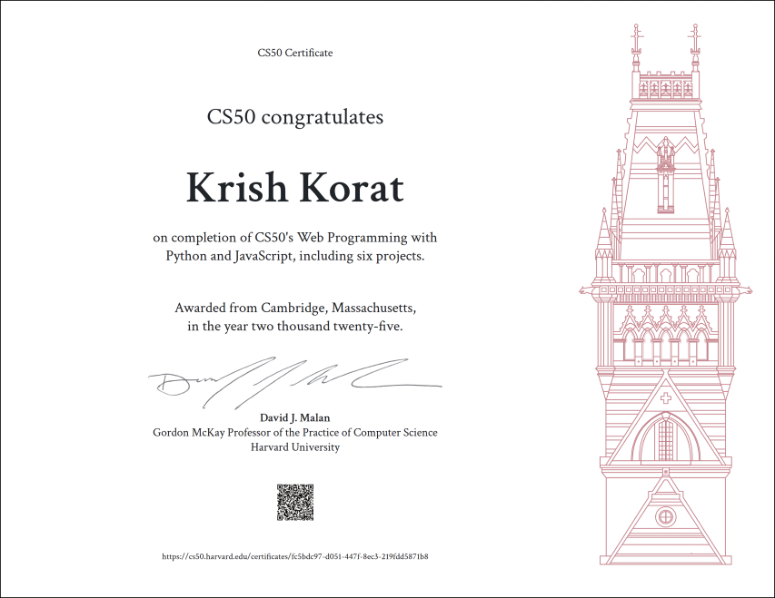

---

# CS50W 2025 Solutions

This repository contains my personal solutions, projects, and coursework completed during **Harvard University’s CS50W – Web Programming with Python and JavaScript**. The program explores modern web development concepts including backend frameworks, databases, APIs, user authentication, client-side scripting, and user experience design.

## Certificate

## Course Units

* HTML, CSS
* Git
* Python
* Django
* SQL, Models, and Migrations
* User Authentication
* JavaScript
* Frontend + APIs
* Testing and Deployment

## Projects Completed

* Project 0: Search
* Project 1: Wiki
* Project 2: Commerce
* Project 3: Mail
* Project 4: Network
* Final Project: F1Garage (F1 Fantacy Game)

## Notes

* These submissions represent my own implementation of each project.
* Code adheres to CS50W academic honesty and submission guidelines.

## Reference

Official Course Website: [https://cs50.harvard.edu/web/2020](https://cs50.harvard.edu/web/2020)

---
